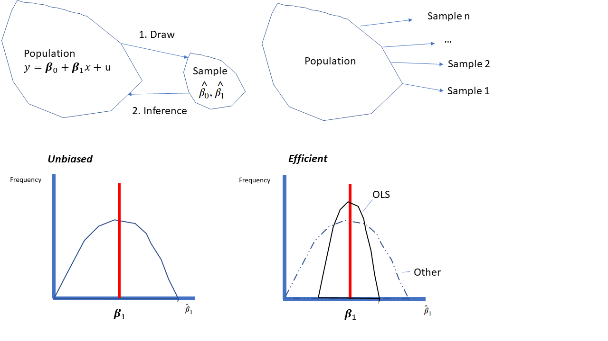

```{r setup, include=FALSE}
knitr::opts_chunk$set(echo = FALSE)
```

# Session 3+4 - Part D: Refresher of Econometrics (IV)


## What we do in Session 3+4 - Part D

- ***Properties of OLS***
- ***Endogeneity and exogeneity***
- Solutions to overcome endogeniety problems
  - Randomized experiments
  - Control variables
  - Sample split regressions
  - ***Instrument variables and 2SLS***


## Properties of OLS

If five assumptions hold, then the OLS estimator $\hat{\beta}_1$ is the **B**est **L**inear **U**nbiased **E**stimator (BLUE)

- *U*nbiased: If we run OLS with different random samples, the expected value of the estimated parameter equals the true
- *B*est: Most efficient: OLS has the lowest variance of all estimators in the linear class 
- *L*inear: OLS is in the class of linear models
- *E*stimator: From a sample, we try to make inference about the true value in the population parameter

## Five assumptions that give the BLUE property to the OLS estimator: 

For future reference, it is useful to number these assumptions using the prefix "SLR" for simple linear regression.

- SLR.1: Linear in Parameters: $y=\beta_0+\beta_1x+u$
- SLR.2: Random Sampling of $y$ and $x$ from the population
- SLR.3: Variation in the sample values $x_1,...,x_n$
- SLR.4: Zero conditional mean: $E(u|x)=E(u)=0$
- SRL.5: The error $u$ has the same variance given any value of the explanatory variable (homoscedasticity): $Var(u|x)=\sigma^2$

## $U$nbiased + $B$est (=efficient)

In a simulation of $T$ random draws, OLS parameters will be 

- correct on average (estimated $\hat{\beta_1}$ centered around true $\beta_1$)
- closest to the true values most often (lowest variance)

```{r , echo=FALSE, out.width = "90%", fig.align = "center"}

```


## Focus on assumption of unbiasedness 

not other violations, e.g., heteroskedasticity, autocorrelation

**Heteroskedasticity**: (non-constant) variance of $u$ depends on $x$

- winter: low variation of demand shock and price (always 0)
- summer: high variation of shock and price (sunny / rainy)

**Autocorrelation**: persistent demand shocks across periods

<br>

Those are moderately important. If one of the two is violated 

- the OLS estimator $\hat{\beta}$ is still unbiased but not efficient 
- calculate standard errors using an appropriate formulas


## Exogenous and endogenous Variables

The most important assumption is exogeneity of variables $x$. 

- excluded variables in $u$ not systematically correlated with $x$ 
- $x$ is **exogenous**, 
  - if uncorrelated with $u$, i.e., $\mbox{cor}(x_t,u_t)=0$
- We say $x$ is **endogenous** 
  - if $\mbox{cor}(x_t,u_t)\ne0$

<br>

This is related to assumption SLR.4 $\mathbb{E}(u|x)=\mathbb{E}(u)=0$ 

- can only be satisfied if $x$ is exogenous.
- we discussed this in the last lecture

## The problem of endogeniety

If $x$ is endogenous, the OLS estimator $\hat{\beta}$ is biased.

- We typically check endogeniety as follows (intuitively):
  - Think which factors are part of the random shock $u$
  - Reason if your $x$ is correlated with factors in $u$.
  
<br>

Ice cream example: 

- Seasonal demand is part of the error term $u$ 
- Prices $x$ correlated with seasonal demand 
- because prices differ with high demand and low demand 
- Thus, the correlation is not 0 and we have endogeneity

## "Problem" of the endogeneity problem 

For real world data, we never observe $u$

- we cannot simply see in the data if is endogeniety 
- if we compute the correlation between $p$ and $u$ 
  - we see that it is always 0 by construction
  - even if $u$ and $p$ are correlated.
- So arguing that there is endogeneity is a verbal exercise

However, we now use simulated data to outline the issue. 

## Exploring Endogeniety in R

We consider again our simulated data for ice cream demand 

- demand depends on prices and unobserved demand shocks 
- ***case 1***: prices depend on unobserved demand shocks  
- ***case 2***: there are not unobserved demand shocks 
- ***case 3***: constant markups of always 10% above cost

<br>

In which cases is the OLS estimator biased due to endogeneity?

  - Hint: think of correlation between $u$ and $p$ 

## A simple economic model

... of the data generating process 

<br>

Demand in period $t$ is given by the following function 

$$q_{t}=a_{t}-bp_{t}$$

<br>

We find optimal prices and quantities are given by: 

$$p^*_{t} = \frac{a_0+\varepsilon_t}{2b}+\frac{c_{t}}{2}$$ 


## First define the model
```{r, echo=TRUE}
T=1000
b1 = 100 # we called this a before
b2 = -1 # we called this b before

# demand shock
eps = rnorm(n = T,mean = 0,sd = 5)

# costs
c=runif(T,min = 10,max = 30)

# equation for optimal prices
p = (b1 + eps)/(2*b2)  + c / 2

# demand function
q = b1 + eps - b2*p
```

## Now we run a regression 

What do you think of this relation?

```{r, echo=TRUE}
lm(q~p)
```

## Correlation: prices and error term 

By construction the error term $u$ 

- is zero on average
- has zero correlation with $p$

```{r, echo=TRUE}
model <- lm(q~p)
u <- residuals(model)

mean(u)
cor(p,u)
```

## Correlation: prices and demand shock

But we do know that $p$ depends on demand shock $eps$. 

```{r, echo=TRUE}
cor(p,eps)
```
And indeed we find a correlation which is not zero. 

- This $eps$ is in error term creating a bias
- We can rewrite: $u=eps+v$
- $u$ depends on a part 
  - $eps$ correlated with $p$
  - $v$ uncorrelated with $p$

## We reduce the the demand shock $eps$ 

Let us now decrease the eps towards 0. 

- What is then the main source of variation in prices? 
- To which value will $cor(p,eps)$ converge? 
- Will there still be correlation with the error term?

We study whether the OLS estimator is biased in this case.

## Set demand shock equal to zero


```{r,echo=TRUE}
T=1000
b1 = 100
b2 = -1

# demand shock
eps = rnorm(n = T,mean = 0,sd = 0.0001)

# costs
c=runif(T,min = 10,max = 30)

# equation for optimal prices
p = (b1 + eps)/(2*b2)  + c / 2

# demand function
q = b1 + eps - b2*p
```

Prices affected by $b1$, $b2$, and $c$ but not by $eps$

## Set demand shock equal to zero

Are we now close to the true values? 

```{r,echo=TRUE}
lm(q~p)
```
## Set demand shock equal to zero

```{r,echo=TRUE}
model<-lm(q~p)
u<-residuals(model)

cor(p,u)
cor(p,eps)
```

we get consistent parameters of $b0$ and $b1$ 

- when no correlation between $p$ and $eps$


## Constant markup model

Now assume prices $p$ are always set 10% above the cost $c$ 

- prices are just a constant markup above costs 
- and uncorrelated with the demand shock

<br>

Two questions for you: 

- Are prices $p$ then endogenous or exogenous? 
- Is the OLS estimator biased?


## Define the new model

```{r, echo=TRUE}
T=1000
b1 = 100
b2 = -1

# demand shock
eps = rnorm(n = T,mean = 0,sd = 5)

# costs
c=runif(T,min = 10,max = 30)

# equation for optimal prices
p = 1.1*c 

# demand function
q = b1 + eps - b2*p
```

## Constant markup model

Do we find consistent estimates?

```{r, echo=TRUE}
lm(q~p)
```

## Summary: what have we learned?


## Methods to estimate causal effects

Methods to overcome endogeniety problems to have causal and unbiased effects (like the slope of a demand function)

- Conduct a randomized experiment
- Add control variables
- Sample split regressions
- ***Use instrumental variable estimation***

<br>

We only focus on IV but you can self study the remainder 


## Conduct a Randomized Experiment

Ideal method to get a causal effect *(Scientific Gold Standard)*  

<br>

Pharmaceutical companies who want to register new drugs 

  - we randomly select two groups, i.e., they are identical
  - we give one group the medication (treatment) 
  - and the other receives a placebo (control)
  - both identical groups only differ in outcome of treatment

<br>

However, not always possible, or too costly, to randomize 
 
 - We thus need other approaches


## Control variables: Motivating example

Assume the demand function for ice is given by the following (***long***) regression formula with two explanatory variables:

$$q_t = \beta_0 + \beta_1 p_t + \beta_2 s_t + v_t$$
where $s_t$ is a dummy variable equal to 1 if the day is sunny and 0 otherwise, and $v_t$ is our error term
  
Assume we estimate the (***short***) regression model:
$$q_t = \beta_0 + \beta_1 p_t +u_t$$
If data was generated by the long model, it must hold that $$u_t = \beta_2 s_t + v_t$$

## Question for you

Is $\beta_1$ biased if we estimate the short regression via OLS? 

-  $s$ is part of the error term $u$ if omitted from the regression 
- Since $p$ is correlated with $s$, $p$ is then correlated with $u$
- We have an endogeneity problem and a biased estimator.


## Create data with seasonality (0/1)

```{r,echo=TRUE}
T=1000
b0 = 100
b1 = -1
b2 = 20

# create error term v 
v = rnorm(T,0,5)

# seasonality (random variable of 0/1 for hot or not hot)
s = sample(x = c(0,1),size = T,replace = TRUE)

# equation for optimal prices
p = 10*s + runif(T,20,30)
  
# demand function
q = b0 + b1*p + b2*s + v

# error term with omitted variable seasonal dummy
u = b2*s + v
```

## Output of short regression

Are coefficients biased and do we have $cor(p,u)=0$?

```{r,echo=TRUE}
# short regression
lm(q~p)
cor(p,u)
```
## Output of long regression

Are coefficients biased and do we have $cor(p,u)=0$?

```{r,echo=TRUE}
# long regression
lm(q~p + s)
```
## Randomized price experiment

We now conduct a randomized experiment. 

- That is, prices are randomly set across seasons
- This means that prices do not depend on the season $s$
- Demand, however, is still a function of $s$

<br>

Lessons to be learned 

- we can exclude variables that are correlated with demand
- we should not exclude factors correlated with price


## We create randomized prices

```{r,echo=TRUE}
T=1000
b0 = 100
b1 = -1
b2 = 20

# error term 
v = rnorm(T,0,5)

# seasonality (random variable of 0/1 for hot / not hot)
s = sample(c(0,1),T,replace = TRUE)

# equation for optimal prices
p = runif(T,20,30)
  
# demand function
q = b0 + b1*p + b2*s + v
```

## ... and run the short regression

```{r}
# short regression
lm(q~p )
```

<br>

we get unbiased estimates if prices are not correlated with unobserved factors in the error term

## Summary: Control variables

if observed variables are correlated with the error term

  - We can now just include them in the regression as controls 

<br>

By adding control variables, we 

- remove factors from the error term and 
- make our explanatory variable of interest exogenous.


## Exogeneity in regressions with controls

If we estimate the short regression
  $$q_t = \beta_0 + \beta_1 p_t +u_t$$
  where
  $$u_t = \beta_2 s_t + v_t$$

$p$ is endogenous if it is correlated with $u$ through $s$  

- Assume we add $s$ as control variable and estimate

  $$q_t = \beta_0 + \beta_1 p_t + \beta_2 s_t + u_t$$
  
$p$ is exogenous if uncorrelated with $v$, even if correlated with $s$.
  


## Which control variables to add?

Assume you want to study the gender pay gap *discrimination* 

- the regression is wage a dummy variable for gender 
- use a cross-sample of all men and all woman from all jobs
- you find that men are payed 10\% more than women

<br>

Can you conclude a causal effect? 

- Or would you include control variables?
- If so, which?


## Causal gender paygap? 
```{r , echo=FALSE, out.width = "100%", fig.align = "center"}
knitr::include_graphics("gender_paygap.jpg")
```

... or do we need to correct for hours worked?

## Higher wages from Ivy-League college?

You analyse how obtaining a degree from Harvard affects wages

- the regression is wage a dummy for being from Harvard
- would you get a causal effect?
- add as control variable the high-school grades?

<br>

Angrist and Pischke exploit an experiment where it is randomized whether similar students 

- are admitted to Harvard or go to a public college
- what is your expectation on wages?

## Separate regressions for subsets

Consider again the ice cream demand function

  $$q = \beta_0 + \beta_1 p + \beta_2 s + u$$

- where $s$ is a dummy that is 1 if it is sunny and 0 otherwise. 
- We assume $s$ affects the price $p$ but $u$ is uncorrelated with $p$. 

Alternative way to control for $s$: estimate separate regressions, 

- each using only observations with the same value of $s$

## Separate regressions for subsets

Control by separate regressions for subsets of the data

- First, we only take the observations where $s_t=0$:
  $$q = \beta^0_0 + \beta^0_1 p + u$$
- Then we only take the observations where $s_t=1$:
  $$q = \beta^1_0 + \beta^1_1 p + u$$

The slope estimates $\hat \beta^0_1$ and $\hat \beta^1_1$ of both regressions are consistent estimates of $\beta_1$ and the difference in estimated constants $\hat \beta^1_1$- $\hat \beta^0_1$ is a consistent estimate of $\beta_2$. 

## We show this in R
```{r, echo=TRUE, message = FALSE}
dat = data.frame(q=q,p=p,s=s)

# use filter from package dyplr
library(dplyr)

# first data subsample s=0
dat0 = filter(dat, s==0)

# second data subsample s=1
dat1 = filter(dat, s==1)
```

## 
```{r, echo=TRUE, message = FALSE}
# short regression for subsample s=0 
lm(q~p, dat0 )
```
## 
```{r, echo=TRUE, message = FALSE}
# short regression for subsample s=1
lm(q~p , dat1)
```

# IV regression to control for endogenbeity

## Endogeneity without observing control

As discussed, omitting variables which are correlated with our $x$

- results in a violation of $\mathbb{E}(u|x)=\mathbb{E}(u)=0$
- error term correlated with observable: $cor(u,x)\neq 0$
- sometimes we do not have a good control variable
  - e.g., we do not observe high/low demand shocks

<br>

**Instrumental variables (IV)** solve the endogeneity issues

- unbiased estimator of the unknown causal coefficients 


## Instrumental Variable Regression

To understand how IV regression works, think of the variation in $x$ as having two parts:

- one part that, for whatever reason, is correlated with $u$ 
  - this is the part that causes the problems
- and a second part that is uncorrelated with $u$.
  - this is the part we want to use
<br> 

If you can isolate the second part from the first, 

- then you could use variations of this uncorrelated part of $x$  
- disregard the variations in the problematic part of $x$  

## Grapical illustration

```{r , echo=FALSE, out.width = "100%", fig.align = "center"}
knitr::include_graphics("IV_idea1.jpg")
```

if there is a variable correlated with our endogenous variable, but uncorrelated with the problematic part, 

- then we could isolate the unproblematic part


## An instrumental variable...

or short, instrument, $z$ for an endogenous variable $x$ is a variable that satisfies the following two conditions:

- Relevance: $z$ is correlated with the endogenous variable $x$
  - $cor(p,z)\neq 0$
- Exogeneity: $z$ is not correlated with the disturbance $u$ 
  - $cor(z,u)=0$

Per endogenous variable in the regression model, 

- at least one instrument that is not part of the model


## Two conditions graphically  

<br> 
<br> 

```{r , echo=FALSE, out.width = "70%", fig.align = "center"}
knitr::include_graphics("instr_req.png")
```

<br>

Problem: $u$ affects both $x$ and $y$

Solution: find $z$ which is correlated with $x$ but not with $y$

## Sketch of 2SLS

If the instrument $z$ satisfies the conditions of instrument relevance and exogeneity, the coefficient $\beta_1$ can be estimated 

We can use an estimator called **two stage least squares (2SLS)**.

- First stage decomposes $x$ into two components: 
    - a problematic component that may be correlated with the regression error 
    - and another, problem-free component that is uncorrelated with the error.
- Second stage: use problem-free component to estimate $\beta_1$.

## Implementation of 2SLS

***First stage***: 

- Estimate $x=\gamma_0 + \gamma_1z$ 
- (ALL coviariates that are used in the main estimation have to be included in this step!)
- Save $\hat{x}$, the first stage estimate of $x$

***Second stage***: 

- Regress $y=\beta_0+\beta_{1}\hat{x}+u$ 
- Note $z$ only appears in the first stage, not in the second stage
- This is called the **exclusion restriction**


## Instrument for ice cream prices?

```{r , echo=FALSE, out.width = "70%", fig.align = "center"}
knitr::include_graphics("structure.jpg")
```

## Instruments in Ice Cream Example

$$q = \beta_0 + \beta_1 p + \varepsilon$$

- Check if $c$ is instruments for $p$  
  - satisfies the relevance and exogeneity condition?

$c$ is the required excluded instrument that is not part of the demand function.


## 2SLS with example of demand

Perform 2SLS running two OLS estimations. 

1. Regress the $p$ on instrument $z$
  
  $$p = \gamma_0 + \gamma_1 c + \eta$$

  - Then compute the *predicted values* of this regression 
    $$\hat{p}=\hat \gamma_0 + \hat \gamma_1 c$$
    
2. Estimate the original regression but substitute in the $\hat{p}$1.

  $$q=\beta_{0}+\beta_{1}\hat{p}+u$$

$\hat \beta$ of this second stage is a unbiased estimator of $\beta$.

##  Generate our data 
```{r,echo=TRUE}
T=1000
b1 = 100
b2 = -1

# demand shock
eps = rnorm(n = T,mean = 0,sd = 5)

# costs
c=runif(T,min = 10,max = 30)

# equation for optimal prices
p = (b1 + eps)/(2*b2)  + c / 2

# demand function
q = b1 + eps - b2*p
#lm(q~p)
```
##   IV regression via 2SLS

Aim in first stage: get exogenous variation of prices due to costs

```{r,echo=TRUE}
# Price equation: p = gamma0 + gamma1*c + eta
reg1 <- lm(p ~ c)
reg1

# Obtain predicted value: p.hat = gamma0.hat + gamma1.hat*c
p.hat = fitted(reg1)
```

##   IV regression via 2SLS

Aim in second stage: use predicted values of first stage

```{r,echo=TRUE}
# Price equation: p = gamma0 + gamma1*c + eta
reg2 = lm(q~p.hat)
reg2
```

## Better use ivreg from package AER
```{r,echo=TRUE,message = FALSE}
# Price equation: p = gamma0 + gamma1*c + eta
library(AER)

ivreg(q~p | c)

```
standard errors are different because with 2SLS, we get wrong standard errors


## Learning objectives

- Know under which assumption you can use OLS
- Understand differece between endogeneity and exogeneity
- Learn solutions to overcome endogeneity problems
- Being able to conduct IV regressions