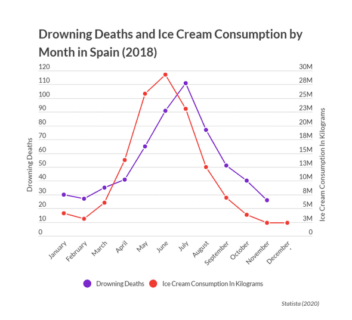

```{r setup, include=FALSE}
knitr::opts_chunk$set(echo = FALSE)
```

# Introduction 

## Overview of Session 3+4

What we do in Session 3+4

- Intro: Intuitive examples of causality vs correlation
- Understanding the causal effect of price on demand
- 


## Clearly there are some strange studies

Some examples of real research questions (and results) are

- Winning a nobel price by eating more chocolate?
- Do storks deliver babies?

Other examples are

- More likely to drown after eating ice cream?
- Does Internet Explorer cause murders?

## Eating chocolate to get Nobel price?
```{r , echo=FALSE, out.width = "80%", fig.align = "center"}
knitr::include_graphics("choc1.png")
```

## Graphical support for the hypothesis
```{r , echo=FALSE, out.width = "75%", fig.align = "center"}
knitr::include_graphics("choc2.png")
```

## NEJM is a leading prestige journal 
```{r , echo=FALSE, out.width = "80%", fig.align = "center"}
knitr::include_graphics("nejm.png")
```

## Do storks deliver babies?
```{r , echo=FALSE, out.width = "80%", fig.align = "center"}
knitr::include_graphics("storks.png")
```

## Positive relationship between the two
```{r , echo=FALSE, out.width = "80%", fig.align = "center"}
knitr::include_graphics("stork1.png")
```

## What is potentially driving the results? 
```{r , echo=FALSE, out.width = "50%", fig.align = "center"}
knitr::include_graphics("stork2.png")
```

## Do you drown after eating ice cream?
```{r , echo=FALSE, out.width = "80%", fig.align = "center"}

```


## Internet explorer causes murder?
```{r , echo=FALSE, out.width = "80%", fig.align = "center"}
knitr::include_graphics("explorer.png")
```

## Learning objectives

- Understand difference between causality and correlation
- Being able to spot omitted variable bias
- Create summary statistics and plots in R using dplyr & ggplot2
- Revisit the basics of linear regression models

# Understanding the effect of price on demand

## Bob’s Ice Cream Business

- Bob bought a small ice cream truck from Emma 
- Emma left Bob a small collection of sales data, in which she noted for each day $t$
  - the price $p_{t}$ she had set
  - the number of ice cream portions $q_{t}$ she had sold
  - the wholesale cost $w_{t}$ for buying a big box of ice cream
- You are a young consultant who shall help Bob to optimize his ice cream business. 
- How would you proceed to find an optimal pricing rule?

## Loading Emma's data it into R

As a consultant you of course have put Emma's data into an excel spreadsheet. We load it as follows: 

```{r, echo=TRUE}
# install.packages("rio")
library("rio")

# import data set using command import from package rio
ice_cream_sales <- import("ice cream sales.csv")

# First have a look at the data, with: Alternative: View(ice_cream_sales)
str(ice_cream_sales)

```

## Summarize the data using pipe syntax

Pipes ‘%>%’ from package `dplyr', where in 4 seperate lines

1. we first choose the name of the data set of interest; followed by ‘%>%’ which means ‘then’ 
2. ‘select(x1,x2,...)’ to choose variables of interest 
3. ‘summary()’ to produce summary statistic
4. ‘kable()’ to produce nice tables

## Summary statistics using pipes

```{r,echo=TRUE, message = FALSE}
library(dplyr) 
library(knitr)
library(kableExtra) # extra package to make table fit to slide

ice_cream_sales %>%
select(w,p,q) %>%
summary() %>%
kable()%>%
  kable_styling(full_width = F) # to make table fit to slide
```


## Intuitive relationship between $p$ and $q$?

As a consultant you know the power of graphs, so you type:

```{r,echo=TRUE, out.width = "70%", fig.align = "center"}
plot(p ~ q, data = ice_cream_sales)
```
Was Emma setting profit-maximizing prices?

## Some explanations 

Unobserved factors may increase demand (i.e., demand shocks)

- Advertising may increase demand
- Better quality increase demand
- Seasonality (summer vs winter) likely affects demand 

Price may react in response to demand shocks, e.g., 

- ask for higher prices in summer, when demand is high
- ask for lower  prices in winter, when demand is low

Unobserved factors affect both demand and price

- which might generate the positive relationship

# The economic model behind omitted variables

## A simple economic theory model 

In principle, we can well imagine to have

- a downward-sloping demand function (in price $p$), 
  - with random demand shocks (e.g., due to seasonality)
- and firms which set profit-maximizing prices

and still find a positive relationship between prices and output.

<br>

We now present a simple model of the data generating process

## We first specify the demand function $q$

Demand in period $t$ is given by the following function 

$$q_{t}=a_{t}-bp_{t}$$

- $b>0$: parameter measuring how $q$ changes with $p$
- $a$ measures how high demand would be at price 0

The market size parameter $a_{t}$ is given by 
$$a_{t}=a_{0}+\varepsilon_{t}$$

- $a_{0}>0$ is a constant (some poeple always buy ice cream)
- $\varepsilon_{t}$ is a random “demand shock” in period $t$ (not affected by $p$).
  - Good weather: -> higher $\varepsilon$

## How do firms set profit-maximizing $p$?

The firm’s profits are given by 

$$\pi_{t}=p_{t}q_{t}-w_{t}q_{t} - F$$

- $w_{t}\geq0$ is a constant marginal cost of production in period $t$ (cost of one portion of ice cream)
- $F$ are some fixed costs that don't depend on the price.
- We already know that: $q_{t}=a_{0}+\varepsilon_{t}-bp_{t}$

A firm chooses a price $p_{t}$ that maximizes its profits knowing

- its cost $w_{t}$, 
- the demand shock $\varepsilon_{t}$
- the parameters $a_{0}$ and $b$

## Optimal Prices and output

We find optimal prices and quantities are given by: 

$$p^*_{t} = \frac{a_0+\varepsilon_t}{2b}+\frac{w_{t}}{2}$$ 
$$q^*_{t} = \frac{a_{0}+\varepsilon_{t}}{2}-\frac{b w_{t}}{2}$$

which both depend on $a_t=a_0+\epsilon_t$ 

(Show this by taking the derivative of profits w.r.t. price $\frac{\partial \Pi_t}{\partial p_t}$)

## Proof  (to look at home)

Plug in demand function into profits

$$\begin{align*}
\pi(p_t) & = q_t(p_t)(p-w_{t}) - F\\
 & =(a_{t}-bp_t)(p_t-w_{t}) - F\\
 & =a_{t}p-a_{t}w_t-bp_t^{2}+bp_tw_{t} - F
\end{align*}$$

The first order condition is given by

$$\frac{\partial \pi(p_t)}{\partial p_t} = a_t-2bp_t+bw_t = 0$$

Solving for price $p$

$$p_t = \frac{a_{t}}{2b}+\frac{w_{t}}{2}$$

## Proof (to look at home)

If we plug in $a_t=a_0+\varepsilon_t$, we get
$$\begin{align*}
p^*_{t} & =\frac{a_{0}+\varepsilon_{t}}{2b}+\frac{w_{t}}{2}
\end{align*}$$

Plug this expression into $q$ to get the equilibrium quantity

$$\begin{align*}
q^*_{t} & = a_{0}+\varepsilon_{t} - b p_t^* \\
        & = \frac{a_{0}+\varepsilon_{t}}{2}-\frac{b w_{t}}{2}
\end{align*}$$


## Simulating the model in R

- To get intuition about this economic model, we want to simulate in R.
- Here and in other places I will show you some R code in the class and the steps are roughly described in the slides.
- You will repeat similar steps in more detail in the corresponding RTutor problem sets (here the problem set for Chapter 1a).
  - For that reason you won't get the R code from class. Look at the RTutor problem set instead.

## 

```{r,echo=TRUE}
T = 10 # number of days
a0 = 100 # market size parameter
b = 1
c = runif(T,min = 10, max = 20)
  
sigma.eps = 10 # standard deviation sigma of demand shocks
eps = rnorm(n = T, mean = 0, sd = sigma.eps)

# equation for optimal prices
p = (a0 + eps)/(2*b)  + c / 2

# demand function
q = a0 + eps - b*p
```

## Plot the graph

Indeed we have a positive relationship between $p$ and $q$ 

- although demand is downward sloping due to $b=1$ 
- $b=1$ enters negatively into the demand function

```{r}
plot(x=p,y=q)
```

## 
The reason is that 

- positive epsilons increase both the $p$ and the $q$ 
- while negative epsilons decrease both the $p$ and the $q$. 

To do at home 

- Set T=1000 to see a stronger relationship 
- Decrease epsilon to 0.0001 to see the role demand shock on the relationship between $p$ and $q$
- How does the relationship change between $p$ and $q$?
- What is the slope of demand function?

## Estimating the demand function

- Use the R function lm (stands for linear model) to estimate the following linear regression model of the demand function 

$$\begin{align*}
q_{t}=&\beta_{0}&+&\beta_{1}p_{t}&+\varepsilon_{t} \\
     (=& a_0   &+& (-b)p_t & +\varepsilon_{t})    
\end{align*}$$

## via ordinary least squares (OLS).
```{r, echo=TRUE}
T=1000
lm(q~p) 
```
And of course, we get inconsistent estimates representing the upward sloping relationship from the previous graph. 

## 

Let's replace p with random values and calculate corresponding quantity for high T. Remember that $a_0=100$ and $b=1$


```{r,echo=TRUE}
T = 10000
p = runif(n=T,min = 30,max = 50)
q = a0 + eps - b*p

lm(q ~ p)
```
Are we close to the true values? Justify why resp. why not. 

## 
Given that prices are randomly drawn, they do not depend on demand shock $a$ and we do not have an omitted variable problem. Thus, the effect of $p$ on $q$ is just $a_0=100$ and $b=-1$.As intuitively seen by looking at the demand function.

## Reduce number of observatins to T=10

```{r,echo=TRUE}
T = 10
p = runif(n=T,min = 30,max = 50)
q = a0 + eps - b*p

lm(q ~ p)
```

The estimates seem to be closer to the true values when the number of observations is high. This is known as consistency, which we discuss later.

## What have we done so far?

- **Policy Question:** We want to find a rule to set profit maximizing prices for Bob’s ice cream business.
- **Model for decision:** We discussed how to set profit maximizing prices based on an economic model with a downward sloping “demand function”. To find optimal prices, we need to know / estimate a demand function for ice cream.
- **Data:** We got a historical data set of prices and output. Interestingly, prices are positively correlated with quantity sold.
- **Model of data generating process:** We wrote down and studied a simple model of how the data could have been generated. Similar to our decision model, we assume the model has a downward sloping demand function and prices have been set in a profit maximizing fashion. Importantly, there are also random demand shocks $\varepsilon$ (incorporating conditions like weather) that have been known by the price setter.

## What have we done so far?

- **Simulation:** To get better intuition about the data generating process, we simulated it in R.
  - We found that the model can indeed generate a positive correlation between equilibrium prices and output, even though the demand function is downward sloping. The reason is that positive demand shocks increase both prices and output.
  - We also simulated an alternative model in which prices are set randomly.
- **Estimation:** We estimated a linear regression of our demand function with the simulated data.
  - When prices were set randomly, it looked as if we had a consistent estimator of the true parameters of the demand function
  - When prices were set in a profit maximizing fashion, our estimator of the demand function was inconsistent.

## What will we do next?

1\.  We will review some basic concepts of econometrics, focusing on the linear regession model

  - Key idea in econometrics: there is a true model with random variables that generated the data.
  - Econometric tools, like estimation procedures or statistical tests, only make sense if the model satisfies certain conditions.
  - We study some important tools and concepts.
2\.  We will study instrumental variable (IV) estimation
  - IV estimation is a very prominent method to consistently estimate coefficients in cases in which OLS estimation does not work.
  - IV estimation will allow us to consistently estimate the demand function for our example data set, in which prices have not been set randomly.

