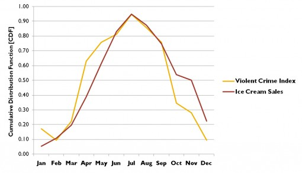

```{r setup, include=FALSE}
knitr::opts_chunk$set(echo = FALSE)
```


## Brilliant minds expressed their scepticism regarding statistics

There are three kinds of lies: lies, damned lies, and statistics (popularized by Mark Twain)
The only statistics you can trust are those you falsified yourself (attributed to Whinston Churchill)
One reason may lie in the abuse of statistics...

Torture the data until it confesses (Mancur Olson, The Logic of Collective Action)
... another in the difficulty of using statistics appropriately

The economy is a miserable experimental design (Robert E. Lucas: quote from J Kennan, Journal of Economic Literature, 1995)
In this class, we learn some some techniques to properly use statistics in economic (and social) environments

## Clearly there are some strange studies

Some examples of real research questions (and results) are

- Chocolate consumption increases the chances of winning a nobel price!
- Storks deliver babies!

## Chocolate Consumption and Nobel Prices
```{r , echo=FALSE, out.width = "80%", fig.align = "center"}
knitr::include_graphics("choc1.png")
```

## 
```{r , echo=FALSE, out.width = "80%", fig.align = "center"}
knitr::include_graphics("choc2.png")
```

## Prestige journal 
```{r , echo=FALSE, out.width = "80%", fig.align = "center"}
knitr::include_graphics("nejm.png")
```

## Ice cream causes drownings?
```{r , echo=FALSE, out.width = "80%", fig.align = "center"}
knitr::include_graphics("IceCreamDrowning.png")
```

## Ice cream causes crimes?
```{r , echo=FALSE, out.width = "80%", fig.align = "center"}

```


## Internet explorer causes murder?
```{r , echo=FALSE, out.width = "80%", fig.align = "center"}
knitr::include_graphics("explorer.png")
```

## Storks deliver babies?
```{r , echo=FALSE, out.width = "80%", fig.align = "center"}
knitr::include_graphics("storks.png")
```

## We clearly find a positive relationship between the two
```{r , echo=FALSE, out.width = "80%", fig.align = "center"}
knitr::include_graphics("stork1.png")
```

## You can try out at home what could potentially drive the results 
```{r , echo=FALSE, out.width = "80%", fig.align = "center"}
knitr::include_graphics("stork2.png")
```

